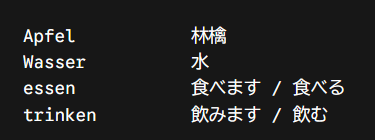
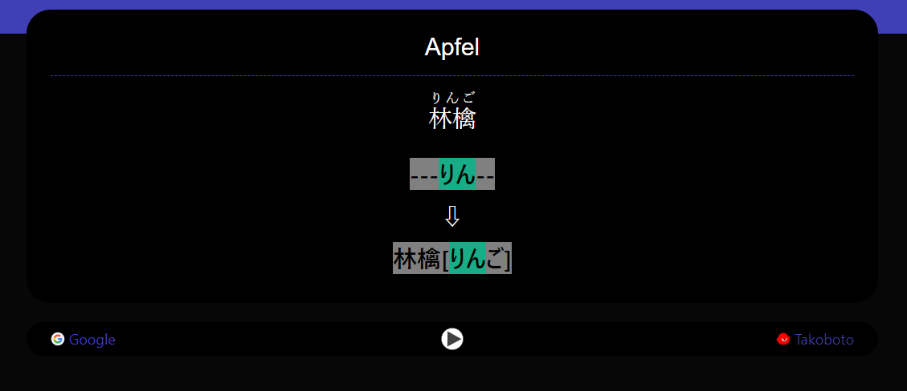

# AI-Image-to-Anki

*Check out my other branches as well: [JAMstack App](https://github.com/UTSGhost/AnkiGenerator/tree/serverless-app) | [Full-Stack Webserver](https://github.com/UTSGhost/AnkiGenerator/tree/web-app)*

Create anki decks based on Images, using Gemini API and `genanki`. 
Currently built for DE -> JP (German to Japanese) including automatic Masu -> Dictionary Form cards for verbs, but can theoretically be adapted for any language.

## Preview
<table>
  <tr>
    <td align="center"><b>Input (image.png)</b></td>
    <td align="center"><b>Result in Anki</b></td>
  </tr>
  <tr>
    <td></td>
    <td></td>
  </tr>
</table>

## How to use
1. **Clone the repository:**

   ```bash
   git clone https://github.com/UTSGhost/AnkiGenerator
   cd AnkiGenerator
   ```
2. **Install dependencies:**
    ```bash
    pip install -r requirements.txt
    ```
3. **Set up your API Key:**
Create a .env file in the root directory and add your Google Gemini API key:
    ```env
    GEMINI_API_KEY="your_api_key_here"
    ```
4. **Run the script:** Place your vocabulary image as image.png in the root folder and run:
    ```bash
    python main.py
    ```
The generated output.apkg can then be directly imported into Anki

## Credits & Sources

Anki Theme / Formatting: Based on the awesome [HachiMoji Theme](https://ankiweb.net/shared/info/1367938531).

